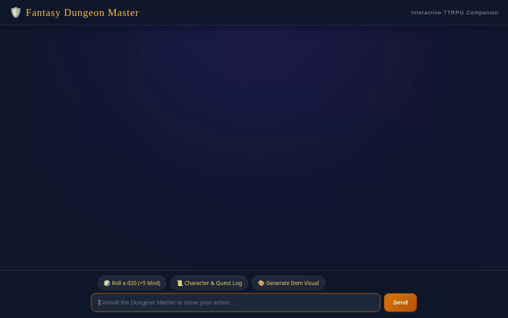

# 🛡️ Fantasy Dungeon Master Agent

An interactive tabletop roleplaying game (TTRPG) companion and Dungeon Master agent built using Google's Agent Development Kit (ADK), Gemini, and Google Cloud Platform. It manages immersive fantasy campaigns, tracks campaign quests in Firestore, generates custom item visual artwork and videos, performs D&D rules lookups, rolls dice, and provides structured A2UI card surfaces.



---

## 🚀 Woven Capabilities & Integrated Services

The following features and Google Cloud Platform services are fully implemented and wired in this codebase:

- **🧠 Memory Bank (PreloadMemoryTool)**: Preserves character statistics, party preferences, past battle outcomes, and campaign narrative state across turns and sessions.
- **🔥 Firestore Database (Google Cloud Datastore)**: Stores and streams campaign quest logs (`get_quests`, `create_or_update_quest`) in Google Cloud Firestore.
- **🎨 Visual Image Generation (Gemini 3.1 Flash Lite Image)**: Generates custom fantasy artwork for weapons, magic items, and creatures using `gemini-3.1-flash-lite-image` in the `global` region.
- **🎬 Video Generation (Gemini Omni Flash Preview)**: Generates short animated fantasy item video demonstrations using `gemini-omni-flash-preview` in the `global` region.
- **☁️ Public Cloud Storage (GCS Bucket)**: Stores generated image and video assets in a public Google Cloud Storage bucket (`gs://qwiklabs-gcp-01-f419067f0d55-static-assets-bucket`) and returns public HTTPS URLs.
- **📚 Vertex AI RAG Engine**: Grounded on Culpeper's Herbal knowledge corpus via `consult_herbal_docs` for ancient lore and remedy lookups.
- **📦 Structured A2UI Surfaces**: Generates rich, compact A2UI card layouts (v0.8 Basic Catalog) rendered dynamically on the chat interface via an `after_model_callback`.
- **💻 Agent Engine Sandbox Code Executor**: Safely executes Python code inside Google Cloud Agent Engine Sandbox for complex encounter calculations, stat adjustments, and dice probability.
- **🎲 Game Mechanics & External Tools**:
  - `roll_dice`: Rolls virtual dice (e.g., `1d20+5`, `2d6+2`).
  - `fetch_random_magic_item`: Queries Open5e REST API for random magic loot.
  - `lookup_dnd_rules`: Queries D&D 5e REST API for official monster, spell, and equipment mechanics.

---

## 🛠️ Local Development & Setup Instructions

Follow these steps to run the agent backend and frontend locally:

### 1. Prerequisites & Virtual Environment

Ensure Python 3.10+ and Node.js are installed, then create and activate a virtual environment:

```bash
python3 -m venv .venv
source .venv/bin/activate
pip install -r app/requirements.txt
pip install -r frontend/requirements.txt
```

### 2. Run the Local Agent Engine Playground

Start the ADK playground server to test the reasoning engine locally:

```bash
agents-cli playground run --port 8000
```

### 3. Run the Custom FastAPI Frontend

From the `frontend/` directory, set the resource variables and start the server:

```bash
export AGENT_ENGINE_RESOURCE_NAME="projects/392896179766/locations/us-central1/reasoningEngines/8984069378383282176"
export AGENT_DIRECTORY="app"
export PORT=8080

cd frontend
python main.py
```

Open your browser and navigate to the local server address configured on port `8080`.

---

## ☁️ Cloud Deployment Architecture

- **Agent Engine / Reasoning Engine**: Deployed to Agent Platform (`projects/392896179766/locations/us-central1/reasoningEngines/8984069378383282176`).
- **Frontend Service**: Deployed to Google Cloud Run (`fantasy-dm-frontend`) in region `us-central1` with IAM permission `roles/aiplatform.user` granted to the Cloud Run compute service account.
